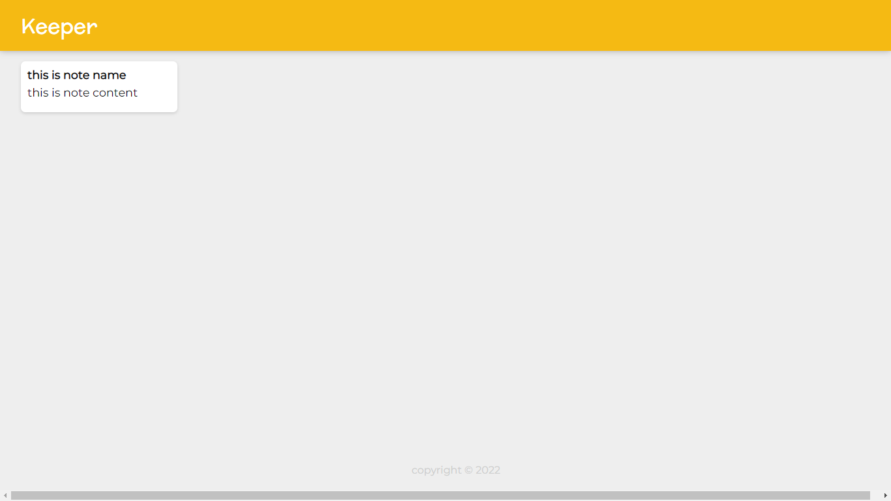

# Keeper-App

Keeper App is used to save your notes for future reference. Developed using React Frontend Interface.

Screenshot of Keeper App

Local Installation

1. Clone the Repo by going to your local Git Client and pushing in the command:
https://github.com/ahmedsami666/Keeper-App
2. Install the Node Modules:
npm install
3. At last, push in the command which will kickstart the application on Local Host:
npm start
